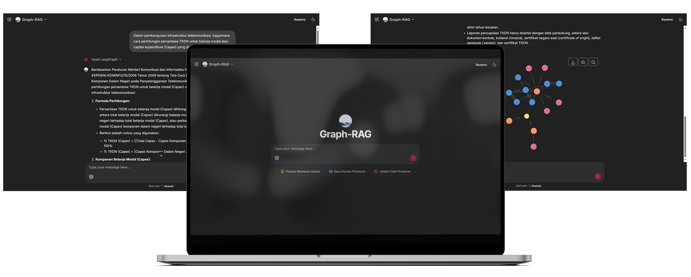

# Indonesian IT Law Question Answering System Based on Graph-RAG



This project is an **Indonesian IT Law Question Answering System based on Graph-RAG**, implemented as a Chainlit application. It combines **Large Language Models (LLMs)** with a structured **knowledge graph of Indonesian IT regulations** (covering **63 IT-related regulations**, data retrieved in **February 2025**) to generate relevant, accurate, and contextual legal answers.

Unlike standard Retrieval Augmented Generation (RAG) methods that rely solely on text or semantic-based retrieval, **Graph-RAG leverages relationships between entities within the knowledge graph**, such as connections between regulations, articles, and legal concepts. This enables the system to:

- Efficiently navigate the relationships between legal entities.
- Generate more detailed and structured answers.
- Help users access legal information even if they do not know specific regulation titles or details.

By integrating these approaches, the system aims to make Indonesian IT legal information more accessible to the general public, especially those without a legal background, while **reducing the risk of hallucinated LLM outputs** by retrieving information from official legal data sources.

> [!NOTE]
> - This system is optimized for the Indonesian language, and performance may vary when used in other languages.
> - Please read the [**Usage Policy & Disclaimer**](#usage-policy--disclaimer) section for more information about project limitations and usage policies.

## Features

*   **Graph-Based Information Retrieval:** Utilizes a Neo4j knowledge graph database to retrieve interconnected legal and regulatory information. Technically, it implements Text2Cypher or Vector-Cypher retrieval methods for comprehensive data access.
*   **LLM Integration:** Integrates Large Language Models (LLMs) with structured graph-based retrieval to generate accurate, contextual, and legally grounded answers.
*   **Chainlit User Interface:** Provides an interactive chat-based interface built using the Chainlit framework for seamless user interactions.
*   **Evaluation Tools:** Includes Jupyter notebooks for evaluating various components and performance aspects of the Graph-RAG workflow.

## Background

As a country governed by law, Indonesia faces challenges in ensuring equal access to legal information for all its people. Although the government provides the Legal Documentation and Information Network (JDIH) service, accessibility remains limited due to the complexity of legal terminology and current search system constraints. To address this issue, we propose a legal question-answering system based on Graph-RAG, combining structured data retrieval via Text2Cypher and unstructured data retrieval via Vector-Cypher using the LangChain and LangGraph frameworks. This approach is expected to help the general public access legal information they may not know, increase answer accuracy based on valid data, and reduce hallucination risks in LLM outputs.

## Prerequisites

Before running the application, ensure you have the following installed and configured:

*   `python==3.11.4`
*   `neo4j==5.26.1`
*   `intfloat/multilingual-e5-large` (HuggingFace embedding model)
*   `llama3.1:8b-instruct-q4_K_M` (available via Ollama, optional for trying a small local LLM model)
*   **Environment Variables (.env):**
    *   `NEO4J_HOST`: URI of your Neo4j database.
    *   `NEO4J_DATABASE`: Name of your Neo4j database (default: `db-large`).
    *   `NEO4J_USERNAME`: Username for your Neo4j database.
    *   `NEO4J_PASSWORD`: Password for your Neo4j database.
    *   `EMBEDDING_MODEL`: Name of the HuggingFace embedding model to use (default: `intfloat/multilingual-e5-large`).
    *   `ANTHROPIC_API_KEY`: API key for accessing Claude models.
    *   `GOOGLE_API_KEY`: API key for accessing Gemini models (optional, used only for evaluation).

## Installation

Follow these steps to set up and run the application:

1.  **Clone the repository:**

    ```shell
    git clone https://github.com/bayu-siddhi/indonesia-it-law-graph-rag.git
    cd indonesia-it-law-graph-rag
    ```

2.  **Create a virtual environment** (optional but recommended):

    ```shell
    python -m venv venv
    source venv/bin/activate  # on Windows: venv\Scripts\activate
    ```

3.  **Install dependencies:**

    ```shell
    pip install -r requirements.txt
    ```

4.  **Set up environment variables:**

    *   Copy the `.env.example` file to create your own `.env` file:

        ```shell
        cp .env.example .env
        ```

    *   Edit the `.env` file and add your credentials:

        ```
        NEO4J_HOST=your_neo4j_address
        NEO4J_DATABASE=your_neo4j_database_name
        NEO4J_USERNAME=your_neo4j_username
        NEO4J_PASSWORD=your_neo4j_password
        EMBEDDING_MODEL=your_huggingface_embedding_model_name
        ANTHROPIC_API_KEY=your_anthropic_api_key
        GOOGLE_API_KEY=your_google_api_key
        ```

5.  **Prepare the Neo4j Database:**

    * Make sure you have a Neo4j database (version **5.26.1**) with the name **`db-large`**.
    * Run the notebook [graph_construction.ipynb](prep/graph_construction.ipynb), specifically **cell number 4**, with the parameters:
      - `database="db-large"`
      - `embedding_model="intfloat/multilingual-e5-large"`
    * This notebook will build the legal knowledge graph and embed the data into your Neo4j database.

> [!NOTE]
> - `GOOGLE_API_KEY` is optional and used only for evaluation purposes.
> - Make sure to replace placeholder values in `.env` file with your actual credentials.
> - This project was built using the dependencies and version numbers listed in [requirements.txt](requirements.txt).
> - Adjust the version numbers, especially the `torch` version, to match your device or CUDA compatibility.

## Usage

1.  **Run the application:**

    ```shell
    chainlit run app.py
    ```

2.  **Interact with the application:**
    *   Open the application in your browser.
    *   Select the "Graph-RAG" chat profile.
    *   Ask questions related to Indonesian IT regulations.
    *   The application will retrieve relevant information from the Neo4j database and generate an answer.

> [!NOTE]
> - Make sure your **Neo4j** database is running before starting the application.  
> - Ensure that **Ollama** is running with the `llama3.1:8b-instruct-q4_K_M` model available (If you want to try the small local LLM model).

## Directory Structure

Below is an overview of the main files and directories in this project:

```
└── indonesia-it-law-graph-rag/
    ├── app.py                            # Main Chainlit application file for Graph-RAG
    ├── prep/                             # Jupyter notebooks for data preparation and graph construction
    ├── public/                           # Static files used in the README and Chainlit application
    ├── data/                             # Regulatory data directory
    │   ├── active/                       # Lists of active regulations before and after selection
    │   ├── pdf/                          # PDF files of the selected regulations
    │   ├── markdown/                     # Selected regulations in markdown text format
    │   │   ├── raw/                      # Raw regulations markdown files converted or scraped from source PDFs or websites
    │   │   │   ├── bpk/                  # Raw regulations markdown files converted from regulation PDF documents
    │   │   │   └── komdigi/              # Raw regulations markdown files scraped from JDIH Komdigi (Kominfo) website
    │   │   └── clean/                    # Cleaned regulations markdown files
    │   │       ├── base/                 # Cleaned base regulations markdown files
    │   │       ├── amendment/            # Cleaned amendment regulations markdown files
    │   │       └── all/                  # Combined cleaned base and amendment regulations markdown files
    │   └── json/                         # Extracted and structured regulation content and metadata with in JSON format
    ├── src/                              # Source code modules
    │   ├── grag/                         # Graph-RAG system modules
    │   │   ├── workflow.py               # Definition of the Graph-RAG workflow
    │   │   ├── agent/                    # Agents for tool usage or final answer generation
    │   │   ├── retrievers/               # Retrieval tools: Text2Cypher and Vector-Cypher
    │   │   ├── fallback/                 # Fallback mechanisms when retrieval tools fail
    │   │   ├── visualizer/               # Knowledge graph visualization modules
    │   │   └── evaluation/               # Evaluation modules for Graph-RAG workflows
    │   └── prep/                         # Data preparation modules
    │       ├── regulation_scraper/       # Scrapers for regulations from JDIH sources
    │       ├── regulation_parser/        # Parsers for regulation content into structured data
    │       ├── encodings.py              # Key-value mappings for data processing
    │       ├── pdf_converter.py          # Converts PDF documents to text
    │       ├── graph_builder.py          # Builds the regulatory knowledge graph
    │       └── utils.py                  # Utility functions for data manipulation
    ├── ui/                               # User interface modules
    │   └── grag/                         # Chainlit implementation of the Graph-RAG system
    ├── eval/                             # Datasets and Jupyter notebooks for system evaluation
    └── README.md                         # Project documentation (this file)
```

## Usage Policy & Disclaimer

⚠️ **Disclaimer:**

This project and its outputs are intended for **informational and educational purposes only**. It does **not constitute legal advice**.

- Always consult with qualified legal professionals or refer to official government sources before making any decisions or interpretations based on the information provided by this system.
- The developers and contributors of this project are **not responsible for any actions, decisions, or damages** arising from the use or misuse of any information generated by Graph-RAG.
- The system uses publicly available regulations retrieved from official documentation networks (JDIH) as references. However, the **completeness, timeliness, and accuracy of the answers are not guaranteed**, as the system and its topic development still require further improvements and thorough evaluations.
- **Scope of data:** This system covers **63 Indonesian IT regulations** (see the last section in [chainlit.md](chainlit.md) for the full list), with the **latest data collection conducted in February 2025**. Therefore, there may be regulations that have been amended or are no longer valid at the time you use this system.
- By using this application, you acknowledge and agree to these terms.
